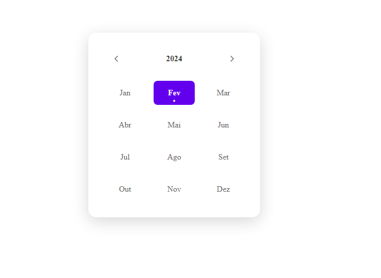

# Data Picker #boraCodar #17

- Construção do componente de um calendario utilizando Html, Css e Javascript 

Estrutura de repetição for... of
Logica no front end
Array
Funçao 
DOM 

> Data Picker #boraCodar #17

## 🔗 Deploy 

👉🏼[Link do projeto](https://bora-codar-17-data-picker.vercel.app/)

#  💻🔧 Tecnologias

## Contato 💻

